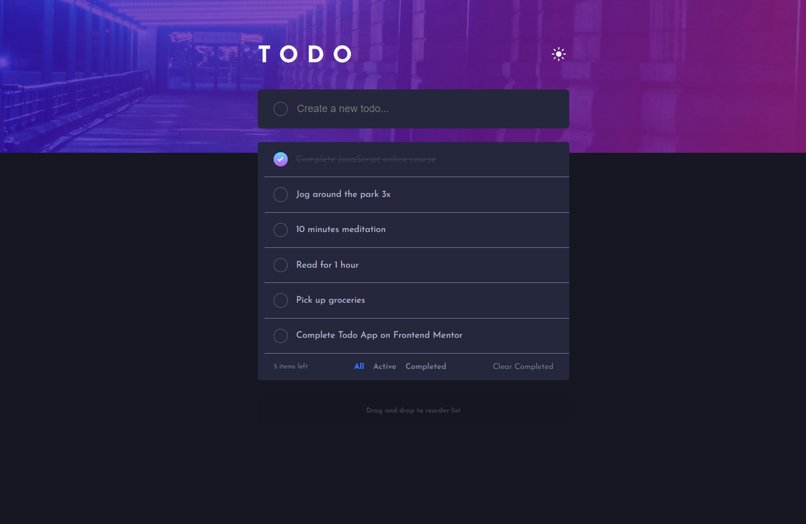

# Frontend Mentor - Todo app solution

This is a solution to the [Todo app challenge on Frontend Mentor](https://www.frontendmentor.io/challenges/todo-app-Su1_KokOW). Frontend Mentor challenges help you improve your coding skills by building realistic projects.

## Table of contents

- [Overview](#overview)
  - [The challenge](#the-challenge)
  - [Screenshot](#screenshot)
  - [Links](#links)
- [My process](#my-process)
  - [Built with](#built-with)
  - [What I learned](#what-i-learned)
  - [Continued development](#continued-development)
  - [Useful resources](#useful-resources)
- [Author](#author)
- [Acknowledgments](#acknowledgments)

## Overview

### The challenge

Users should be able to:

- View the optimal layout for the app depending on their device's screen size
- See hover states for all interactive elements on the page
- Add new todos to the list
- Mark todos as complete
- Delete todos from the list
- Filter by all/active/complete todos
- Clear all completed todos
- Toggle light and dark mode
- **Bonus**: Drag and drop to reorder items on the list

### Screenshot

### Links

- [Solution URL](https://github.com/javascriptor1/todo-app-main)
- [Live Site URL](https://toodoo-appplication.netlify.app/)

## My process

Hello everyone 👋, I'm Mohammed and this is my solution to this nice challenge.

I will briefly talk about my current process of solving FEM challenges and I hope it will help and inspire other beginners (like me 😊). To make this process actionable so others can follow, I will list the steps I take to solve the challenge-

1- I download the challenge resource file and extract it in a special folder so I can use it in the future if needed without having to re-download it again.

2- After the files were extracted, I read about the requirements to solve the challenge.

3- After reading the requirements, I open the design folder to see the final product both for mobile and desktop screens. I also take note of the number of active state elements so I don't forget to do it while solving the main challenge.

4- After I see both photos for screen designs, I take some notes on how best to do the HTML markup and how to structure the elements in the page. This is a very very important issue and help in later steps. I pick up the best semantic tags which serve the purpose of the content.

5- I then create CSS styling and Javascript files, link them to the HTML file, initialize a new git repo, and make an initial commit on the master branch.

6- Then I do the actual markup of all texts in the challenge file for mobile screens. for example, if a text is best displayed as an H1 tag, I wrap the text in h1 tag using a shortcut in VScode, etc.. I also add images and icons at this stage. then I create a new git branch for mobile design before I start styling.

**Note**: I always do mobile-first solution and don't combine mobile and desktop styling at the same stage.

7- After I finish the markup stage, I go to the styling stage targeting mobile screens. I use a live server on VScode, go live and open the page in my Chrome, then use the **Pixel perfect** extension to load the design file for the mobile screen as an overlay on top of my actual page. I make sure the overlay image is exactly 100% on top of my HTML page. I make sure I choose the right screen resolution which is 375px.

8- At this stage, I use the **Responsively app** to see how the page will look like on different screen sizes. I usually have the following screen sizes opened at the same time:

- iPhone SE 375px **Fem design size for mobile**
- iPhone Pro Max 428px
- iPad mini 768px
- iPad Air 820px
- iPad Pro 1024px
- My screen size 1366px
- MacBook Pro 1440px **Fem design size for desktop**

9- After I finish the mobile screen design, I commit all changes, check to master branch, then merge the mobile-design branch with the master branch.

10- I then create a new branch for desktop design, load the design image as an overlay on Chrome using the extension, and start coding on a custom screen size of 1440px I created for this purpose.

11- I repeat step 9 with the desktop branch. Then I create a new branch to style active state elements and I repeat step 9 after I finish all requirements.

**Note**: I will add a new git branch in the future for accessibility, SEO, and performance so I improve this area also.

12- I move to the Javascript part of the challenge after I create a new git branch for it.

13- After I solve the Javascript part, I commit and merge into the master branch and my solution is ready for deployment.

14- I do final checks to make sure all things are working as they should, then I deploy to Netlify.

15- I then upload my solution to FEM website

This is a brief process overview I developed over time. I know it’s not perfect for sure but it's a good start for a beginner like me with big room for improvement in the future.

This process does not take into account frameworks or libraries I might use in my solution. In case I did use such frameworks (like Tailwindcss for example), I install them at the initial stage.

I love to hear from you. Please let me know how can I improve my process OR share your process so we all benefit from each others.

**Built with** 🛠

- Semantic HTML5 markup ✔
- CSS custom properties 🎨
- CSS Flexbox🎁
- Mobile-first workflow 📱
- [PixelPerfect](https://www.welldonecode.com/perfectpixel/) chrome extension👌
- [Responsively](https://responsively.app/)✌
- [Web ToolBox](https://web-toolbox.dev/en/tools/image-compare-slider)⚒

**What I learned**

- DOM traversing, DOM attribute manipulation
- Drag and drop API

**Continued development**

- Drag and drop API
- Background images sizes

**Useful resources**

- [Traversing the DOM with JavaScript](https://zellwk.com/blog/dom-traversals/)

**Author**

- Twitter -[https://twitter.com/javascriptor1]
